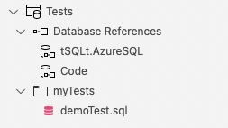

# AzureSQLDevOpsDemo

Something insightful

tSQLt mention here

https://tsqlt.org/

Using the tsql tutorial

https://tsqlt.org/user-guide/tsqlt-tutorial/

#### Prerequisites

githib
ADS
docker

### Getting Started with Database Change Management and Azure Data Studio

how to do it

Sample scenario with tSQLt example

## Example Repository Contents

The repository consists of two Database Projects (.sqlproj), a dacpac with tSQLt installed, a GitHub Actions workflow and some supporting files for database setup/creation and running the tSQLt tests.

### The Code Project

This project was created by using the built-in schema compare tools in Azure Data Studio to extract the database objects and create .sql files from them.

It is separated out into object type folders in the FinancialApp schema.

### The Test Project

The Test project contains the dacpac with tSQLt installed as well as the tSQLt tests (in the demoTest.sql file)

## Known Issues

At this time, tSQLt will not install into an Azure SQL Edge container database but local development/change management is still possible.