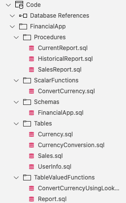

# Connecting the Dots of Azure SQL CICD Part 3: Testing with tSQLt

### Prerequisites

Refer to [part 1](https://devblogs.microsoft.com/azure-sql/connecting-the-dots-of-azure-sql-cicd-part-1-getting-started/) and [part 2](https://devblogs.microsoft.com/azure-sql/azure-sql-database-change-management/) for the prerequisites.

* [git](https://learn.microsoft.com/en-us/devops/develop/git/install-and-set-up-git)
* A [GitHub](https://github.com/) account
* [Visual Studio Code](https://code.visualstudio.com/Download)
* [Docker](https://docs.docker.com/engine/install/)
* [.NET Core SDK](https://dotnet.microsoft.com/en-us/download/dotnet/3.1)

Check out the blog post [here](https://devblogs.microsoft.com/azure-sql/connecting-the-dots-of-azure-sql-cicd-part-3-testing-with-tsqlt/).

And start by forking this project!

Using the [tsql tutorial](https://tsqlt.org/user-guide/tsqlt-tutorial/)

### Example Repository Contents

The repository consists of two Database Projects (.sqlproj), a dacpac with tSQLt installed, a GitHub Actions workflow and some supporting files for database setup/creation and running the tSQLt tests.

### The Code Project

This project was created by using the built-in schema compare tools in Azure Data Studio to extract the database objects and create .sql files from them.

It is separated out into object type folders in the FinancialApp schema.

### The Test Project

The Test project contains the dacpac with tSQLt installed as well as the tSQLt tests (in the demoTest.sql file). It also has a reference to the Code project so that with a single publish, both projects with be deployed into a new database.

## Known Issues

At this time, tSQLt will not install into an Azure SQL Edge container database but local development/change management is still possible.
